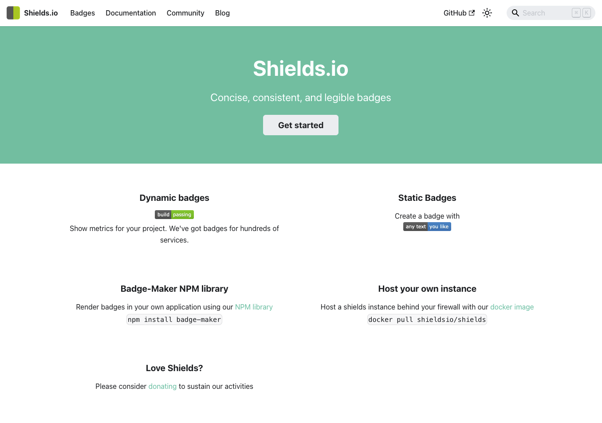

<!--
Este archivo README esta generado automaticamente<https://github.com/YunoHost/apps/tree/master/tools/readme_generator>
No se debe editar a mano.
-->

# Shields para Yunohost

[](https://ci-apps.yunohost.org/ci/apps/shields/)


[](https://install-app.yunohost.org/?app=shields)

*[Leer este README en otros idiomas.](./ALL_README.md)*

> *Este paquete le permite instalarShields rapidamente y simplement en un servidor YunoHost.*  
> *Si no tiene YunoHost, visita [the guide](https://yunohost.org/install) para aprender como instalarla.*

## Descripción general

Shields.io is a service for concise, consistent, and legible badges in SVG and raster format, which can easily be included in GitHub readmes or any other web page. The service supports dozens of continuous integration services, package registries, distributions, app stores, social networks, code coverage services, and code analysis services.

**Versión actual:** 2025.01.01~ynh1

## Capturas



## Documentaciones y recursos

- Sitio web oficial: <https://shields.io/>
- Documentación administrador oficial: <https://shields.io/docs>
- Repositorio del código fuente oficial de la aplicación : <https://github.com/badges/shields>
- Catálogo YunoHost: <https://apps.yunohost.org/app/shields>
- Reportar un error: <https://github.com/YunoHost-Apps/shields_ynh/issues>

## Información para desarrolladores

Por favor enviar sus correcciones a la [rama `testing`](https://github.com/YunoHost-Apps/shields_ynh/tree/testing).

Para probar la rama `testing`, sigue asÍ:

```bash
sudo yunohost app install https://github.com/YunoHost-Apps/shields_ynh/tree/testing --debug
o
sudo yunohost app upgrade shields -u https://github.com/YunoHost-Apps/shields_ynh/tree/testing --debug
```

**Mas informaciones sobre el empaquetado de aplicaciones:** <https://yunohost.org/packaging_apps>
